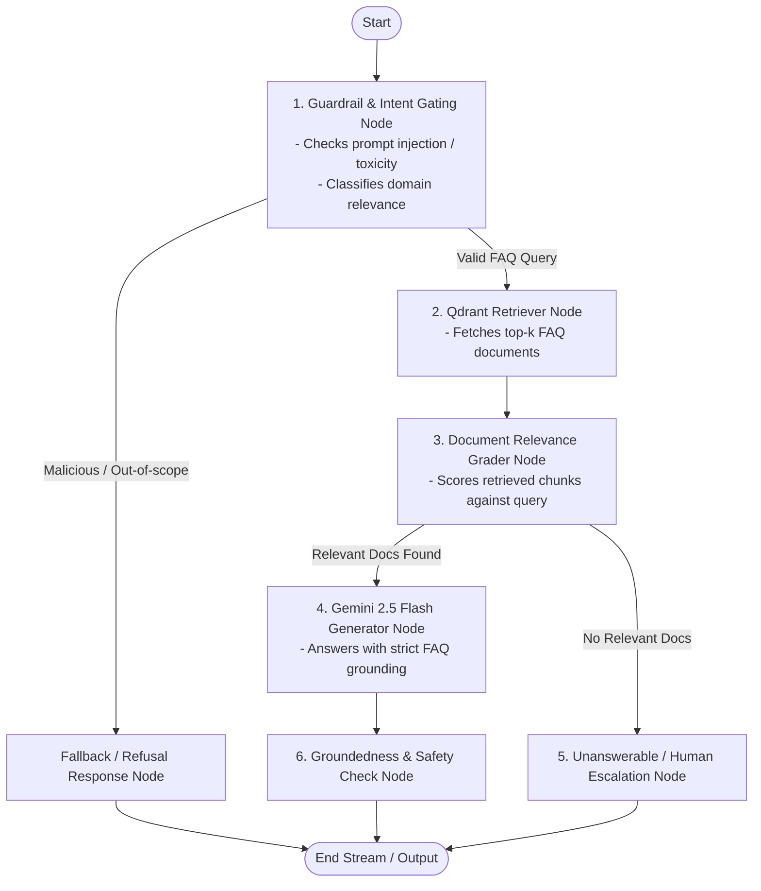

# AGENTS.md - FAQ RAG Chatbot Architecture & Guidelines

## 1. Project Overview & Objective
This project is an enterprise-grade, recruitment-standard FAQ RAG Chatbot built with a modular, maintainable, and observable architecture.

### Core Technology Stack
- **Agent Orchestration**: LangGraph (StateGraph with stateful multi-node control flow)
- **Framework & Tools**: LangChain (`langchain-core`, `langchain-community`, `langchain-google-genai`, `langchain-qdrant`)
- **LLM**: Google Gemini 2.5 Flash (`ChatGoogleGenerativeAI(model="gemini-2.5-flash")`)
- **Embeddings**: Google Gemini Embeddings (`gemini-embedding-2` / `models/text-embedding-004`)
- **Vector Database**: Qdrant (`qdrant-client`, local persistent embedded storage at `./data/qdrant_db`)
- **Guardrails & Security**: Input validation, prompt injection heuristics, safety filter, and domain relevance grading
- **User Interface**: Modern, responsive Streamlit web application (`app.py`)
- **Testing & Quality Assurance**: Comprehensive `pytest` test suite covering ingestion, graph nodes, retrieval accuracy, and guardrails

---

## 2. LangGraph Workflow Architecture

The RAG pipeline is orchestrated as a directed graph using **LangGraph** with explicit state transitions:



### Graph State Schema (`GraphState`)
- `question`: `str` — Original user input query
- `chat_history`: `List[BaseMessage]` — Multi-turn conversation messages
- `is_safe`: `bool` — Security check result (True if passed, False if flagged)
- `guardrail_reason`: `Optional[str]` — Explanation if blocked by guardrails
- `documents`: `List[Document]` — Retrieved FAQ chunks from Qdrant
- `relevance_score`: `float` — Highest similarity / relevance score
- `generation`: `str` — Generated answer from Gemini
- `sources`: `List[Dict[str, Any]]` — Attributed FAQ sources (Question, Category, ID)

---

## 3. Directory Structure & Layer Responsibilities

```
faq_bot/
├── config/
│   ├── __init__.py
│   └── settings.py             # Pydantic Settings reading .env (API keys, models, thresholds)
├── src/
│   ├── state.py                # LangGraph GraphState definition
│   ├── ingestion/
│   │   ├── __init__.py
│   │   ├── parser.py           # Markdown FAQ structured parser (Question, Answer, Category)
│   │   └── indexer.py          # Embedding & indexing into Qdrant collection
│   ├── vectorstore/
│   │   ├── __init__.py
│   │   └── qdrant_client.py    # Local persistent Qdrant initialization & collection setup
│   ├── nodes/
│   │   ├── __init__.py
│   │   ├── guardrail_node.py   # Prompt injection & harmful input detection
│   │   ├── retrieve_node.py    # Vector retrieval with similarity threshold gating
│   │   ├── grade_node.py       # Context relevance evaluation
│   │   └── generate_node.py    # Gemini 2.5 Flash response generation
│   ├── graph.py                # LangGraph workflow builder and compiled graph instance
│   └── utils/
│       ├── __init__.py
│       └── logger.py           # Structured logging configuration
├── tests/
│   ├── test_ingestion.py       # FAQ parser & chunking verification
│   ├── test_qdrant.py          # Vector store upsert & search tests
│   ├── test_guardrails.py      # Adversarial prompts, jailbreaks, and harmful input tests
│   ├── test_graph.py           # LangGraph node execution & state transitions
│   └── test_e2e_rag.py         # End-to-end question answering & citation verification
├── app.py                      # Modern Streamlit UI with streaming & source inspection
├── FAQ.md                      # Source knowledge base
├── pyproject.toml              # Project dependencies & packaging
├── .env.example                # Template for required environment variables
└── README.md                   # Setup guide, architecture details & test instructions
```

---

## 4. Coding Standards & Best Practices

1. **Modularity & Single Responsibility**: Every module must have a single clear concern. Keep business logic out of Streamlit UI code (`app.py` only renders and invokes the graph).
2. **Strict Type Annotations**: Use Python `typing` (`List`, `Dict`, `Optional`, `TypedDict`, `Annotated`) on all functions and classes.
3. **Pydantic for Data & Config**: Use Pydantic `BaseModel` for payloads and `BaseSettings` / `pydantic-settings` for environment configuration.
4. **Comprehensive Docstrings**: Follow Google Python style guide for all functions, classes, and modules.
5. **Robust Error Handling**: Handle API exceptions, network timeouts, and missing files with clear custom error messages and fallback responses.
6. **No Hardcoded Secrets**: Always read API keys from `.env` via `config/settings.py`.
7. **Clean Logging**: Use structured logging instead of naked `print` statements.

---

## 5. Security & Guardrails Protocol

- **Input Guardrails**:
  - Heuristic & regex patterns for prompt injection (`ignore previous instructions`, `system prompt override`, `jailbreak`).
  - Content safety checks (filtering toxicity, hate speech, sexual content, PII extraction).
  - Out-of-scope domain detection (verifying if query relates to the company FAQ).
- **Output Guardrails**:
  - Strict grounding prompt: instruct Gemini never to hallucinate facts outside the retrieved FAQ context.
  - Source attribution: every valid response must provide the exact FAQ Question & Section.

---

## 6. Execution & Testing Commands

```bash
# 1. Ingest FAQ into Qdrant
python -m src.ingestion.indexer

# 2. Run Automated Pytest Suite
pytest tests/ -v --tb=short

# 3. Launch Streamlit Chatbot Web App
streamlit run app.py
```
