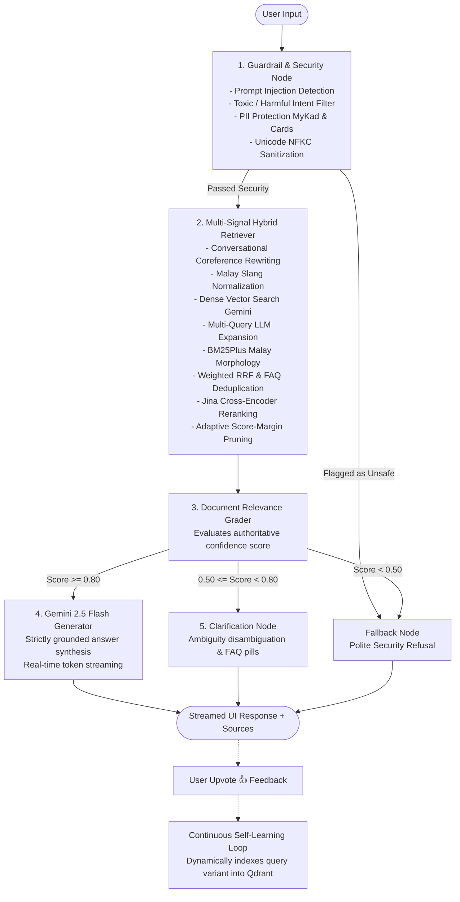

<div align="center">

# 📺 Tonton FAQ AI Assistant
### Enterprise Multi-Signal RAG Chatbot with LangGraph, Google Gemini & Qdrant

[](https://www.python.org/)
[](https://github.com/langchain-ai/langgraph)
[](https://ai.google.dev/)
[](https://ai.google.dev/)
[](https://qdrant.tech/)
[](https://jina.ai/reranker)
[](https://streamlit.io/)
[-brightgreen?logo=pytest)](https://docs.pytest.org/)

<p align="center">
  <b>A recruitment-standard, production-grade Retrieval-Augmented Generation (RAG) conversational agent built for Tonton (Media Prima) OTT platform customer support.</b>
</p>

</div>

---

## 📖 Table of Contents
- [Project Overview](#-project-overview)
- [Key Features](#-key-features)
- [Architecture & Workflow](#-architecture--workflow)
- [Engineering Highlights](#-engineering-highlights)
  - [1. Multi-Signal Hybrid Retrieval & Weighted RRF](#1-multi-signal-hybrid-retrieval--weighted-rrf)
  - [2. Malay Morphological Stemming in BM25](#2-malay-morphological-stemming-in-bm25)
  - [3. Cross-Encoder Reranking & Adaptive Score-Margin Pruning](#3-cross-encoder-reranking--adaptive-score-margin-pruning)
  - [4. 3-Tier Confidence Routing State Machine](#4-3-tier-confidence-routing-state-machine)
  - [5. Enterprise Security Guardrails & PII Protection](#5-enterprise-security-guardrails--pii-protection)
  - [6. Continuous Self-Learning Engine](#6-continuous-self-learning-engine)
  - [7. Real-Time Asynchronous Token Streaming](#7-real-time-asynchronous-token-streaming)
- [Project Structure](#-project-structure)
- [Getting Started](#-getting-started)
  - [Prerequisites](#prerequisites)
  - [Installation](#installation)
  - [Environment Configuration](#environment-configuration)
  - [1. Data Ingestion & Indexing](#1-data-ingestion--indexing)
  - [2. Launching the Streamlit Application](#2-launching-the-streamlit-application)
- [Automated Testing](#-automated-testing)
- [Configuration Reference](#-configuration-reference)
- [License](#-license)

---

## 🌟 Project Overview

**Tonton FAQ AI Assistant** is an enterprise-grade customer support assistant engineered to resolve subscriber inquiries regarding subscriptions, billing, streaming errors, account management, and content accessibility for Malaysia's leading OTT service, **Tonton**.

Unlike simple single-prompt bots, this system implements a stateful **LangGraph StateGraph** pipeline that marries dense semantic vector embeddings (`gemini-embedding-2`), lexical keyword matching (`BM25Plus` with Malay morphological awareness), multi-query generation, conversational coreference rewriting, cross-encoder neural reranking (`Jina AI`), and strict grounding guardrails to eliminate hallucinations and deliver instant, reliable answers.

---

## 🚀 Key Features

- **Stateful Multi-Node Graph Orchestration**: Built on LangGraph with deterministic state transitions, short-term thread memory (`InMemorySaver`), and conditional branch routing.
- **Hybrid Retrieval with Reciprocal Rank Fusion (RRF)**: Integrates primary dense vector search, LLM-driven multi-query reformulations, and BM25 keyword matching weighted into a single unified candidate pool.
- **Malay Morphological Stemming & Slang Normalization**: Proprietary affix stripping (`pemb-`, `memb-`, `peny-`, `memper-`, `ber-`, `-kan`, `-an`) and colloquial Malaysian chat normalization (`x bole` &rarr; `tidak boleh`, `camne` &rarr; `bagaimana`, `acc` &rarr; `akaun`).
- **Two-Stage Reranking & Adaptive Pruning**: Jina AI Cross-Encoder computes query-document cross-attention and adaptively trims noisy tail results via dynamic score margins.
- **3-Tier Confidence Routing**:
  - 🟢 **High Confidence ($\ge 0.80$)**: Direct grounded synthesis with Gemini 2.5 Flash.
  - 🟡 **Medium Confidence ($0.50 - 0.80$)**: Interactive disambiguation proposing the most relevant FAQ topics.
  - 🔴 **Low Confidence / Out of Scope ($< 0.50$)**: Polite refusal directing users to official support channels.
- **Enterprise Guardrails & PII Protection**: Bilingual (Malay & English) prompt injection heuristics, harmful intent filters, and automated masking of sensitive data (Malaysian MyKad ICs and Credit Card numbers).
- **Autonomous Self-Learning**: Captures positive user feedback (👍) and automatically ingests customer phrasing into Qdrant as new search vectors for continuous recall improvement without manual dataset re-indexing.
- **Real-Time Token Streaming UI**: Modern dark-mode Streamlit frontend with smooth asynchronous token streaming, pipeline status breadcrumbs, latency metrics, and expandable source citations.

---

## 📐 Architecture & Workflow

The conversation lifecycle follows a directed, stateful pipeline managed by LangGraph:



### Graph State Schema (`GraphState`)
| Field | Type | Description |
| :--- | :--- | :--- |
| `question` | `str` | Original user input query |
| `chat_history` | `Sequence[BaseMessage]` | Conversational history for multi-turn coreference resolution |
| `is_safe` | `bool` | Flag indicating whether input passed guardrail checks |
| `guardrail_reason`| `Optional[str]` | Detailed reason if blocked by security filters |
| `documents` | `List[Document]` | Top-k retrieved and reranked FAQ documents |
| `relevance_score` | `float` | Authoritative relevance / cross-encoder similarity score |
| `is_relevant` | `bool` | Relevance boolean evaluated by grader node |
| `routing_intent` | `Optional[str]` | Intent routing tag: `high_confidence`, `needs_clarification`, `out_of_scope` |
| `generation` | `str` | Final assistant response text |
| `sources` | `List[Dict[str, Any]]` | Attributed FAQ metadata (ID, category, question, URL) |

---

## 🛠️ Engineering Highlights

### 1. Multi-Signal Hybrid Retrieval & Weighted RRF
Rather than relying on pure vector search, the retrieval pipeline combines three independent search signals:
- **Primary Dense Vector Search (Weight: 1.0)**: Google `gemini-embedding-2` asymmetric document/query embeddings.
- **Lexical BM25 Search (Weight: 0.8)**: `BM25Plus` matching exact keywords and technical error messages.
- **Multi-Query Expansion Search (Weight: 0.6)**: LLM generated semantic query reformulations.

All candidate lists are fused using **Weighted Reciprocal Rank Fusion (RRF)**:
$$\text{RRF Score}(d) = \sum_{m \in \text{Signals}} w_m \cdot \frac{1}{k + \text{rank}_m(d)} \quad (k = 60)$$

### 2. Malay Morphological Stemming in BM25
Standard tokenizers fail on agglutinative Malay morphology where root words take complex prefixes and suffixes (e.g., *pembayaran* $\rightarrow$ *bayar*, *membatalkan* $\rightarrow$ *batal*, *tergendala* $\rightarrow$ *gendala*). The custom tokenizer in `src/retrieval/__init__.py` extracts root lemmas to ensure exact keyword recall across varied inflectional forms.

### 3. Cross-Encoder Reranking & Adaptive Score-Margin Pruning
Initial candidates from RRF are passed to the **Jina AI Multilingual Cross-Encoder (`jina-reranker-v2-base-multilingual`)**, computing deep cross-attention between the query and candidate documents. To eliminate hallucination risks from noisy tail documents, the system applies **Adaptive Score-Margin Pruning**:
$$\text{Keep Document } d_i \iff (\text{Score}(d_{\text{top}}) - \text{Score}(d_i)) \le \text{margin} \quad (\text{default: } 0.25)$$

### 4. 3-Tier Confidence Routing State Machine
Prevents ungrounded hallucinations through deterministic confidence-based routing:
- **$\ge 0.80$**: Generates a strictly grounded response with cited step-by-step instructions.
- **$0.50 \le \text{score} < 0.80$**: Prompts the user with structured clarification choices matching the closest FAQ topics.
- **$< 0.50$**: Returns an polite out-of-scope response with official contact options.

### 5. Enterprise Security Guardrails & PII Protection
- **Bilingual Injection Prevention**: Defends against classic English jailbreaks (`ignore previous instructions`, `DAN mode`) and Bahasa Melayu attacks (`abaikan arahan terdahulu`, `tunjuk prompt sistem`).
- **PII Scrubbing**: Automatically detects and blocks queries containing Malaysian MyKad numbers (`\d{6}-\d{2}-\d{4}`) and 16-digit credit card sequences to ensure user privacy and regulatory compliance.
- **Unicode Sanitization**: Normalizes inputs to Unicode NFKC and strips invisible control characters and zero-width spaces.

### 6. Continuous Self-Learning Engine
When a user submits a positive rating (👍) on an answer:
1. The user's query phrasing is extracted and embedded with `gemini-embedding-2`.
2. The vector is upserted into Qdrant as an active variant linked to the target FAQ item ID.
3. Subsequent searches with identical colloquial phrasing achieve immediate high-confidence vector matches without retraining or full corpus re-indexing.

### 7. Real-Time Asynchronous Token Streaming
The Streamlit frontend implements a thread-safe bridge connecting LangGraph's asynchronous event generator (`astream_events`) with Streamlit's synchronous render loop via Python `queue.Queue`, providing real-time typewriter token streaming alongside step-by-step pipeline status updates.

---

## 📁 Project Structure

```
faq_bot/
├── config/
│   ├── __init__.py
│   └── settings.py             # Pydantic Settings with .env configuration
├── src/
│   ├── state.py                # LangGraph TypedDict GraphState definition
│   ├── graph.py                # LangGraph StateGraph builder & compiled instance
│   ├── ingestion/
│   │   ├── __init__.py
│   │   ├── parser.py           # Structured Markdown FAQ parser & synthetic generator
│   │   └── indexer.py          # Embedding generation & Qdrant vector indexing pipeline
│   ├── vectorstore/
│   │   ├── __init__.py
│   │   └── qdrant_client.py    # Persistent local Qdrant manager & embedding wrappers
│   ├── retrieval/
│   │   ├── __init__.py         # BM25Plus index, Malay morphological tokenizer & RRF
│   │   └── query_expansion.py  # Conversational query rewriter & multi-query generator
│   ├── reranker/
│   │   ├── __init__.py
│   │   └── jina_client.py      # Jina AI cross-encoder client & adaptive score pruner
│   ├── nodes/
│   │   ├── __init__.py
│   │   ├── guardrail_node.py   # Bilingual prompt injection, harmful intent & PII filter
│   │   ├── retrieve_node.py    # Multi-signal hybrid retrieval node
│   │   ├── grade_node.py       # 3-tier confidence grading node
│   │   ├── generate_node.py    # Strictly grounded Gemini 2.5 Flash generation node
│   │   ├── clarification_node.py # Medium confidence disambiguation node
│   │   └── fallback_node.py    # Polite out-of-scope & refusal node
│   ├── feedback/
│   │   ├── __init__.py
│   │   └── feedback_store.py   # Persistent feedback logger & Qdrant self-learning engine
│   └── utils/
│       ├── __init__.py
│       ├── logger.py           # Centralized structured logging
│       └── normalizer.py       # Malaysian slang & colloquial chat normalizer
├── tests/
│   ├── test_guardrails.py      # Adversarial attacks, jailbreaks, PII & edge cases
│   ├── test_qdrant.py          # Vector store lifecycle, search & schema tests
│   ├── test_ingestion.py       # Markdown parsing, chunking & synthetic generation tests
│   ├── test_normalizer.py      # Slang mapping & Malay text normalization tests
│   ├── test_query_expansion.py # Coreference rewriter, multi-query & RRF tests
│   ├── test_reranker.py        # Jina cross-encoder & score pruning tests
│   ├── test_clarification.py   # Disambiguation node unit tests
│   ├── test_feedback_store.py  # Feedback logging, analytics & self-learning tests
│   ├── test_graph.py           # LangGraph state transitions & short-term memory tests
│   └── test_e2e_rag.py         # End-to-end question answering integration tests
├── .streamlit/
│   └── config.toml             # Custom theme configuration for Streamlit
├── data/
│   ├── qdrant_db/              # Persistent local Qdrant vector database storage
│   └── feedback_store.jsonl    # Persistent user feedback and ratings audit trail
├── app.py                      # Production Streamlit UI with streaming & analytics
├── FAQ.md                      # Source knowledge base (Tonton Media Prima FAQ)
├── pyproject.toml              # Dependencies & pytest configuration
├── .env.example                # Template configuration file
├── AGENTS.md                   # System design rules & architectural specifications
└── README.md                   # Project documentation
```

---

## ⚡ Getting Started

### Prerequisites
- **Python 3.14+**
- **uv** (recommended for ultra-fast package management) or **pip**
- **Google Gemini API Key** ([Google AI Studio](https://aistudio.google.com/))
- **Jina AI API Key** ([Jina AI Embeddings](https://jina.ai/)) *(Optional, fallback active if omitted)*

### Installation

1. **Clone the repository:**
   ```bash
   git clone https://github.com/your-username/faq-bot.git
   cd faq-bot
   ```

2. **Set up virtual environment & install dependencies:**
   ```bash
   # Using uv (recommended)
   uv sync

   # Or using standard pip
   python -m venv .venv
   source .venv/bin/activate
   pip install -e .
   ```

### Environment Configuration

Create a `.env` file from the provided `.env.example`:

```bash
cp .env.example .env
```

Configure your API keys in `.env`:
```ini
# Google Gemini API Key (Required for LLM and Vector Embeddings)
GEMINI_API_KEY="your-gemini-api-key-here"

# Jina AI API Key (Optional for Cross-Encoder Reranking)
JINA_API="your-jina-api-key-here"

# Model Configuration
GEMINI_MODEL="gemini-2.5-flash"
EMBEDDING_MODEL="gemini-embedding-2"
JINA_RERANK_MODEL="jina-reranker-v2-base-multilingual"

# Vector Store Path
QDRANT_STORAGE_PATH="./data/qdrant_db"
QDRANT_COLLECTION_NAME="faq_collection"

# Retrieval & Guardrail Settings
TOP_K_RESULTS=3
RETRIEVAL_CANDIDATE_COUNT=10
ENABLE_RERANKER=true
ENABLE_HYBRID_SEARCH=true
ENABLE_MULTI_QUERY=true
ENABLE_GUARDRAILS=true
CONFIDENCE_HIGH_THRESHOLD=0.80
CONFIDENCE_LOW_THRESHOLD=0.50
```

---

### 1. Data Ingestion & Indexing

Parse the structured `FAQ.md` document, compute embeddings, and initialize the persistent Qdrant vector database:

```bash
uv run python -m src.ingestion.indexer
```

*Expected output:*
```
[INFO] Extracted structured documents from FAQ.
[INFO] Generating document embeddings using model: gemini-embedding-2 (task_type=retrieval_document)
[INFO] Successfully indexed FAQ items into Qdrant collection 'faq_collection'
✅ Indexing completed successfully!
```

---

### 2. Launching the Streamlit Application

Start the interactive conversational web interface:

```bash
uv run streamlit run app.py
```

Open your browser at `http://localhost:8501`.

#### Web Interface Features:
- 💬 **Interactive Chat**: Natural multi-turn dialogue in Bahasa Melayu or English.
- ⚡ **Live Streaming**: Real-time response streaming with pipeline step indicator.
- 🔍 **Source Inspection**: Expandable cards revealing exact FAQ sections, IDs, and match confidence.
- 💡 **Quick Prompts**: One-click pills for frequent inquiries (cancellation, password reset, ads).
- 👍 / 👎 **Feedback Buttons**: Direct feedback submission with automatic self-learning ingestion.
- 📊 **Sidebar Analytics**: Live satisfaction metrics and count of autonomously learned variants.

---

## 🧪 Automated Testing

The project includes an extensive test suite covering guardrails, ingestion, vector store operations, retrieval algorithms, graph state transitions, and end-to-end execution.

Run the entire test suite:

```bash
uv run pytest tests/ -v --tb=short
```

### Test Suite Coverage:
| Test Module | Coverage Area | Tests |
| :--- | :--- | :---: |
| `test_guardrails.py` | Prompt injection, jailbreak attempts, PII detection, input sanitization | 6 |
| `test_qdrant.py` | Local storage lifecycle, vector search, upsert operations | 2 |
| `test_ingestion.py` | Markdown cleaning, regex parsing, category inference, variant synthesis | 12 |
| `test_normalizer.py` | Malay slang mapping, negation expansions, technical term replacement | 5 |
| `test_query_expansion.py`| Multi-turn rewriting, multi-query generation, BM25 tokenizer, RRF ranking | 5 |
| `test_reranker.py` | Jina cross-encoder API handling, fallback logic, adaptive margin pruning | 6 |
| `test_clarification.py` | Ambiguous query disambiguation and suggestion pills | 2 |
| `test_feedback_store.py` | JSONL logging, analytics computation, Qdrant self-learning upsert | 4 |
| `test_graph.py` | LangGraph node transitions, 3-tier routing conditions, memory checkpointer | 9 |
| `test_e2e_rag.py` | Full end-to-end integration and citation verification | 2 |
| **Total** | | **53 Passing (100%)** |

---

## ⚙️ Configuration Reference

All settings can be customized via environment variables or `.env` file (managed by `config/settings.py`):

| Variable | Type | Default | Description |
| :--- | :---: | :---: | :--- |
| `GEMINI_API_KEY` | `str` | `""` | Google Gemini API Key |
| `JINA_API` | `str` | `""` | Jina AI API Key for Cross-Encoder Reranker |
| `GEMINI_MODEL` | `str` | `gemini-2.5-flash` | Gemini LLM identifier |
| `EMBEDDING_MODEL` | `str` | `gemini-embedding-2` | Gemini Embedding model identifier |
| `JINA_RERANK_MODEL` | `str` | `jina-reranker-v2-base-multilingual` | Jina cross-encoder model name |
| `QDRANT_STORAGE_PATH` | `str` | `./data/qdrant_db` | Path for local persistent Qdrant database |
| `QDRANT_COLLECTION_NAME`| `str`| `faq_collection` | Qdrant vector collection name |
| `TOP_K_RESULTS` | `int` | `3` | Number of final documents presented to generator |
| `RETRIEVAL_CANDIDATE_COUNT`| `int`| `10` | Number of candidate docs retrieved before reranking |
| `ENABLE_RERANKER` | `bool` | `true` | Enable/disable Jina Cross-Encoder reranking |
| `ENABLE_HYBRID_SEARCH` | `bool` | `true` | Enable/disable BM25 keyword search fusion |
| `ENABLE_QUERY_REWRITING`| `bool` | `true` | Enable conversational coreference rewriting |
| `ENABLE_ADAPTIVE_PRUNING`| `bool` | `true` | Enable dynamic score-margin tail filtering |
| `RERANKER_SCORE_MARGIN`| `float`| `0.25` | Score margin allowed from top hit before pruning |
| `ENABLE_MULTI_QUERY` | `bool` | `true` | Enable multi-query expansion generation |
| `MULTI_QUERY_COUNT` | `int` | `3` | Number of query variants generated |
| `ENABLE_GUARDRAILS` | `bool` | `true` | Activate prompt injection and PII guardrails |
| `CONFIDENCE_HIGH_THRESHOLD`| `float`| `0.80` | Minimum score for direct answer generation |
| `CONFIDENCE_LOW_THRESHOLD` | `float`| `0.50` | Minimum score to prevent out-of-scope fallback |
| `ENABLE_SELF_LEARNING` | `bool` | `true` | Autonomously index upvoted queries into Qdrant |
| `MAX_QUERY_LENGTH` | `int` | `800` | Maximum allowable character length for user queries |

---

## 📄 License

This project is licensed under the [MIT License](LICENSE).
